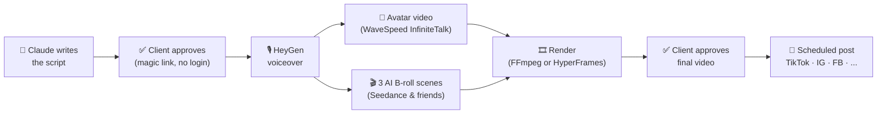

# Video Dashboard

**A self-hosted AI video factory for presenter-led brands.** Type a topic, approve a script, and get a finished vertical video — AI voice, talking avatar, generated B-roll, subtitles, music — scheduled to TikTok, Instagram, Facebook, or any platform your scheduler supports. No filming, no editor, no login for your client.

[](LICENSE)
[](tsconfig.base.json)
[](apps/web)
[](pnpm-workspace.yaml)
[](https://github.com/MK-Chan-MECACA/video-dashboard/pulls)

## What it does

One 75-second video, end to end, for about **$5 in generation credits** and zero minutes on camera:



The presenter appears as a corner bubble speaking every word while AI-generated B-roll carries the story — the "Narrator Bubble" format. Word-level TTS timestamps drive both the burned-in subtitles and the B-roll scene cuts, so everything stays in sync automatically.

## Features

- **Script studio** — Claude drafts hook + scenes + CTA from your brand's system prompt; edit or regenerate any part before it costs you a cent of video credits.
- **Client-proof review** — send a magic link over WhatsApp; the client reads, comments, and approves on their phone. No account, no app.
- **Hands-off production** — on approval the worker runs the whole chain: TTS → avatar → B-roll → composite. Webhooks with a polling backstop; failed jobs retry.
- **Two render engines** — a pure FFmpeg filtergraph, or an [HyperFrames](https://github.com/heygen-com/hyperframes) HTML composition for designed layouts. Switch per-deployment in Settings.
- **Multi-platform publishing** — posts through GoHighLevel's Social Planner to every account you list (TikTok, Instagram Reels, Facebook, YouTube, ...), with a Claude-written caption and per-video scheduling.
- **Fully white-label** — brand name, prompts, voice, logo, outro card, BGM, and layout template all live in the Settings UI, not in code. Fork it, point it at your accounts, ship videos for your brand.

## Architecture

| Path | What it is |
|---|---|
| [`apps/web`](apps/web) | Next.js 15 dashboard (Vercel) — operator UI, magic-link review pages, API routes, generation webhooks |
| [`apps/worker`](apps/worker) | Always-on Node worker (Railway or any Docker host) — Postgres job queue (`FOR UPDATE SKIP LOCKED`), provider calls, FFmpeg render, post scheduling |
| [`packages/shared`](packages/shared) | Pipeline state machine, types, prompts, API clients shared by both |
| [`supabase/migrations`](supabase/migrations) | Postgres schema — videos, scripts, assets, jobs, reviews, posts |

Storage is Cloudflare R2; auth is Supabase (operator login only — reviewers never log in). The worker needs no inbound networking at all.

## Quickstart

```bash
git clone https://github.com/MK-Chan-MECACA/video-dashboard.git
cd video-dashboard
pnpm install
cp .env.example .env       # fill in keys — see SETUP.md
pnpm dev                   # dashboard on :3000
pnpm dev:worker            # pipeline worker (needs ffmpeg installed)
```

Full provisioning (Supabase, R2, HeyGen, WaveSpeed, GoHighLevel, Vercel, Railway) takes about an hour — the step-by-step guide is in [SETUP.md](SETUP.md), including a first-run checklist and a cost breakdown (~$5.10/video in credits at 75s).

## Make it yours

Everything brand-specific is data, not code. After deploying, open **Settings** and:

1. Set your **brand name** — drives the header badge, favicon, and review pages.
2. Fill the **script prompt**'s ABOUT YOUR BRAND block: presenter, audience, offer, boundaries.
3. Tune the **caption prompt** with your hashtags and local tags.
4. Upload **brand assets**: a silent talking-pose video of your presenter (the avatar reference), logo, 1080×1920 outro card, BGM.
5. Pick a **voice** and adjust the **layout template** — presenter bubble position, subtitle style, logo placement, with platform-UI safe zones overlaid in the preview.

`seed-settings.example.mjs` shows how to seed all of this from a script instead of clicking through the UI.

## Why it exists

Presenter-led short-form video works, but the production loop — script, record, edit, subtitle, schedule, chase approvals — eats hours per video. This collapses the loop to two client taps: approve the script, approve the cut. It was built to run a real brand's channel at 8+ videos a week and then open-sourced with the branding stripped out.

## License

[MIT](LICENSE) — commercial use welcome.
